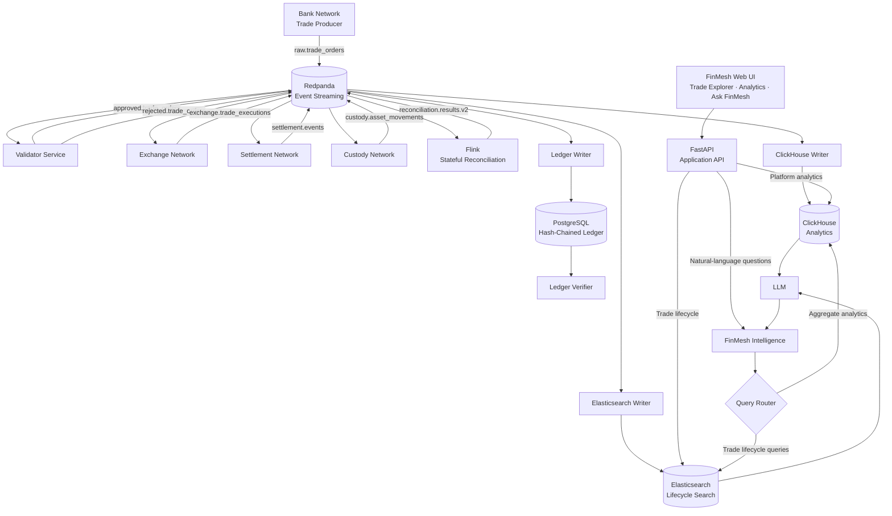

# FinMesh

**Real-Time Network-of-Networks Financial Ledger Simulation**

FinMesh is an event-driven financial transaction simulation that models a trade moving across independent financial network domains: bank, validation, exchange, settlement, custody, and reconciliation.

The platform combines real-time event streaming, stateful stream processing, an immutable hash-chained ledger, analytical storage, lifecycle search, orchestration, observability, and a natural-language intelligence layer.


## Architecture



## Transaction Lifecycle

A simulated trade flows through independent network domains using Redpanda as the Kafka-compatible event backbone.

```text
Bank
  │
  ▼
raw.trade_orders
  │
  ▼
Validator
  │
  ├── rejected.trade_orders
  │
  └── approved.trade_orders
          │
          ▼
       Exchange
          │
          ▼
exchange.trade_executions
          │
          ▼
      Settlement
          │
          ▼
 settlement.events
          │
          ▼
        Custody
          │
          ▼
custody.asset_movements
          │
          ▼
Flink Stateful Reconciliation
          │
          ▼
reconciliation.results.v2
```

Trades can finish in states such as:

- `CONSISTENT`
- `SETTLEMENT_FAILED`
- `CUSTODY_BLOCKED`
- `PENDING`

## Core Capabilities

### Event-Driven Financial Networks

FinMesh models separate bank, exchange, settlement, and custody domains communicating through event streams rather than direct service-to-service calls.

### Stateful Reconciliation with Apache Flink

Flink consumes the lifecycle streams and maintains reconciliation state by `trade_id`.

It determines whether each trade has:

- an approved order,
- an execution,
- successful or failed settlement,
- delivered or blocked custody.

The resulting state is published through the upsert Kafka topic:

```text
reconciliation.results.v2
```

### Hash-Chained Financial Ledger

Lifecycle events are persisted to PostgreSQL using a SHA-256 hash chain.

Each ledger entry incorporates the previous event hash, allowing the ledger verifier to detect:

- modified payloads,
- broken hash links,
- tampered historical records.

### Analytical Storage

ClickHouse stores trade and reconciliation data for analytical queries such as:

- reconciliation status distribution,
- settlement outcomes,
- custody outcomes,
- trades by asset,
- total traded quantity,
- notional value.

### Lifecycle Search

Elasticsearch indexes transaction events so the complete history of a specific trade can be retrieved efficiently.

### FinMesh Intelligence

FinMesh includes a natural-language CLI that routes questions to the appropriate data source.

```text
                    User Question
                         │
                         ▼
                    Query Router
                    /          \
                   /            \
          Trade lifecycle      Analytics
                │                 │
                ▼                 ▼
         Elasticsearch        ClickHouse
                \                 /
                 \               /
                       LLM
                        │
                        ▼
              Grounded response
```

Trade-specific questions retrieve event evidence from Elasticsearch. Aggregate questions query ClickHouse.

The LLM is used to explain retrieved results rather than acting as the system of record.

### FastAPI and Web Interface

FinMesh exposes its investigation and analytics capabilities through a FastAPI application and browser-based interface.

The web interface provides three primary views:

- **Trade Explorer** — retrieves the lifecycle of a specific trade from Elasticsearch.
- **Platform Analytics** — displays reconciliation, settlement, custody, and asset metrics backed by ClickHouse.
- **Ask FinMesh** — sends natural-language questions through the FinMesh Intelligence query router.

FastAPI provides the application boundary between the browser and the underlying FinMesh data services.

The interface is available at:

```text
http://localhost:8000
```

## Technology Stack

| Layer | Technology |
|---|---|
| Event streaming | Redpanda / Kafka API |
| Stream processing | Apache Flink |
| Transaction ledger | PostgreSQL |
| Analytical database | ClickHouse |
| Search / retrieval | Elasticsearch |
| Search UI | Kibana |
| Orchestration | Apache Airflow |
| Observability | Grafana |
| Application services | Python 3.11 |
| Data validation | Pydantic |
| AI interface | OpenAI API |
| Dependency management | uv |
| Infrastructure | Docker Compose |
| Testing | pytest |
| CI/CD | GitHub Actions |
| Application API | FastAPI / Uvicorn |
| Web interface | HTML / CSS / JavaScript |

## Prerequisites

Install:

- Docker with Docker Compose
- Python 3.11+
- `uv`
- `make`
- `curl`

An OpenAI API key is required only for the FinMesh Intelligence natural-language interface.

The core transaction platform can run without it.

## Quick Start

### 1. Clone the repository

```bash
git clone https://github.com/gkaynakk/FinMesh-Real-Time-Network-of-Networks-Financial-Ledger-Simulation
cd FinMesh-Real-Time-Network-of-Networks-Financial-Ledger-Simulation/finmesh
```

### 2. Create local configuration

```bash
cp .env.example .env
```

For FinMesh Intelligence, edit `.env` and provide:

```env
OPENAI_API_KEY=your_openai_api_key_here
OPENAI_MODEL=gpt-5.6-sol
```

Never commit your `.env` file.

### 3. Install Python dependencies

```bash
uv sync
```

Development dependencies, including pytest, can be installed with:

```bash
uv sync --dev
```

### 4. Start FinMesh

```bash
make start
```

This starts the Docker infrastructure, launches the FinMesh application services and FastAPI web application, and submits the Flink reconciliation job.

### 5. Verify the platform

```bash
make health
```

A healthy environment should report services such as:

```text
✓ Docker Compose reachable
✓ Redpanda healthy
✓ PostgreSQL healthy
✓ ClickHouse healthy
✓ Elasticsearch healthy
✓ Flink JobManager healthy
✓ Airflow healthy
✓ Grafana healthy
✓ FinMesh API healthy
```

The application process section should show the FinMesh producers, consumers, and writers as running.

Open the FinMesh web interface:

```text
http://localhost:8000
```

## End-to-End Demo

FinMesh includes a deterministic demo trade producer.

Run:

```bash
uv run python -m demo.run_demo_trade
```

Example:

```text
Submitting demo trade: TRD-DEMO-6C3E90
Trade submitted to raw.trade_orders.
Waiting for FinMesh lifecycle processing...

Demo trade ID: TRD-DEMO-6C3E90
```

The trade enters the same event-driven pipeline used by normal simulated transactions.

Open the FinMesh web interface:

```text
http://localhost:8000
```

Use the generated trade ID in **Trade Explorer** to inspect its lifecycle.

The **Platform Analytics** panels show the current aggregate state of reconciliation, settlement, custody, and asset activity.

The same trade can be investigated through **Ask FinMesh**:

```text
What happened to TRD-DEMO-6C3E90?
```

The command-line intelligence interface remains available:

```bash
uv run python -m intelligence.main
```

Example result from a failed settlement:

```text
TRD-DEMO-6C3E90 followed this lifecycle:

1. Order approved: BUY 25 MSFT at $250.00.
2. Executed at $248.99.
3. Settlement failed due to counterparty_timeout.
4. Reconciliation status: SETTLEMENT_FAILED.

Overall, the trade executed but did not settle because of a counterparty timeout.
```

Because settlement and custody behavior is simulated, the exact lifecycle outcome can vary between demo executions.

## Intelligence Queries

FinMesh currently supports several query categories.

Trade lifecycle:

```text
What happened to TRD-DEMO-6C3E90?
Why did TRD-C3E49666 fail?
```

Settlement analytics:

```text
How many trades have settlement failures?
```

Custody analytics:

```text
How many custody movements are blocked?
```

Reconciliation analytics:

```text
What is the reconciliation status distribution?
How many failed trades are there?
```

Asset analytics:

```text
Which asset has the most trades?
Which asset has the highest notional value?
Which asset has the highest total traded quantity?
```

## Local Interfaces

After `make start`, the platform exposes:

| Service | Address |
|---|---|
| Redpanda Console | `http://localhost:8080` |
| Flink JobManager | `http://localhost:8081` |
| Airflow | `http://localhost:8082` |
| Grafana | `http://localhost:3000` |
| Kibana | `http://localhost:5601` |
| Elasticsearch | `http://localhost:9200` |
| ClickHouse HTTP | `http://localhost:8123` |

Default local credentials configured by the development environment include:

```text
Airflow: admin / admin
Grafana: admin / admin
```

These credentials are intended for local simulation only.

## Useful Commands

Start the complete platform:

```bash
make start
```

Start only the API in development mode:

```bash
make api
```

Check health:

```bash
make health
```

The application process section should show the FinMesh producers, consumers, and writers as running.

Inspect application processes:

```bash
make pipeline-status
```

Follow application logs:

```bash
make logs
```

Verify the PostgreSQL ledger hash chain:

```bash
make verify
```

Stop FinMesh:

```bash
make stop
```

Individual components can also be started through Make targets such as:

```bash
make bank
make validator
make exchange
make settlement
make custody
make clickhouse
make ledger
make elasticsearch
make api
```

## Testing

Run the complete test suite:

```bash
uv run pytest -v
```

The current suite contains **43 tests** covering:

- deterministic canonical JSON and SHA-256 hashing,
- hash-chain behavior,
- ledger tamper detection,
- reconciliation logic,
- Elasticsearch lifecycle retrieval,
- RAG context construction,
- trade ID extraction,
- deterministic query routing,
- ClickHouse analytics,
- FastAPI health and trade lifecycle endpoints,
- analytics API endpoints,
- natural-language intelligence API behavior,
- API input validation and error handling.

## Project Structure

```text
finmesh/
├── airflow/              # Airflow orchestration
├── api/                  # FastAPI application layer
├── core/
│   ├── clickhouse_writer/
│   ├── elasticsearch_writer/
│   ├── ledger_verifier/
│   ├── ledger_writer/
│   ├── reconciliation_service/
│   └── validator_service/
├── demo/                 # End-to-end demo trade
├── docs/                 # Architecture, contracts and runbook
├── flink/                # Flink runtime and reconciliation SQL
├── intelligence/         # Retrieval, analytics, routing and LLM layer
├── networks/
│   ├── bank_producer/
│   ├── custody_network/
│   ├── exchange_network/
│   └── settlement_network/
├── shared/               # Configuration, Kafka, hashing and schemas
├── sql/                  # PostgreSQL and ClickHouse initialization
├── tests/                # Automated tests
├── web/                  # Browser UI
├── docker-compose.yml
├── Makefile
├── pyproject.toml
└── uv.lock
```

`core/reconciliation_service` contains the Python reconciliation implementation used for logic validation and testing. The current full runtime started by `make start` uses **Apache Flink** for stateful reconciliation.

## Event Topics

The primary Redpanda topics are:

```text
raw.trade_orders
approved.trade_orders
rejected.trade_orders
exchange.trade_executions
settlement.events
custody.asset_movements
reconciliation.results.v2
```

## Documentation

Additional documentation is available under `docs/`:

- `docs/architecture.md` — detailed architecture
- `docs/event_contracts.md` — event definitions and contracts
- `docs/runbook.md` — operational instructions

## Design Goals

FinMesh is designed as an engineering simulation rather than a production trading system.

Its purpose is to demonstrate how technologies commonly used across modern data platforms can work together around one coherent problem:

**real-time financial transaction processing across independent networks with traceability, reconciliation, analytics, and AI-assisted investigation.**

## Disclaimer

FinMesh uses simulated financial transactions and is intended for engineering, learning, and demonstration purposes. It is not a brokerage, exchange, payment system, or production financial ledger.