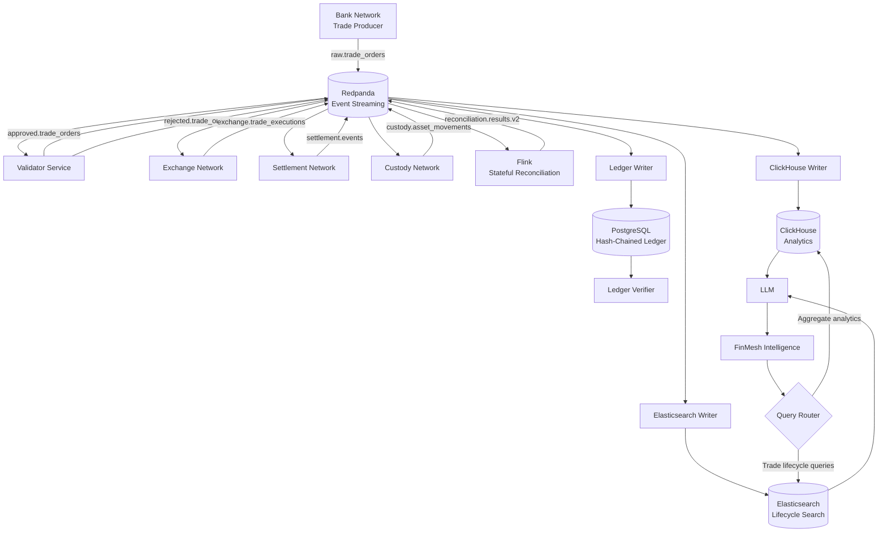

# FinMesh Architecture

FinMesh is an event-driven financial transaction simulation designed around a
network-of-networks model.

Instead of direct service-to-service calls, independent financial domains
exchange events through Redpanda using the Kafka API.

The current FinMesh runtime combines:

- real-time transaction generation,
- validation,
- exchange execution,
- settlement,
- custody,
- stateful reconciliation,
- immutable ledger persistence,
- analytical storage,
- event search,
- orchestration,
- observability,
- and a natural-language intelligence layer.

---

## High-Level Architecture



## Event-Driven Transaction Lifecycle
The transaction lifecycle is asynchronous.
A trade begins in the Bank Network and is published to:

```text
raw.trade_orders
```

The Validator consumes the raw order and either rejects or approves it.
Approved orders continue through:

```text
approved.trade_orders
        ↓
exchange.trade_executions
        ↓
settlement.events
        ↓
custody.asset_movements
```

Each network owns its part of the lifecycle and communicates through Redpanda
rather than directly calling another service.
This separation is the core of the FinMesh network-of-networks design.

## Bank Network

The Bank Network acts as the transaction producer.
It creates simulated trade orders containing fields such as:
trade ID,
customer ID,
asset,
side,
quantity,
price.
The producer intentionally generates invalid orders occasionally to exercise the
validation and rejection paths.
Events are published to:

```text
raw.trade_orders
```

## Validator Service

The Validator consumes raw trade orders and applies business validation rules.

Examples include:
- allowed asset validation,
- positive quantity validation,
- positive price validation.
- Valid trades are published to:

```text
approved.trade_orders
```

Invalid trades are published to:

```text
rejected.trade_orders
```
Downstream financial networks process approved trades only.

## Exchange Network
The Exchange Network consumes approved orders and simulates execution.

It generates an execution event containing information such as:
- execution ID,
- trade ID,
- asset,
- executed quantity,
- execution price,
- execution timestamp.
- Execution events are published to:

```text
exchange.trade_executions
```

## Settlement Network
The Settlement Network consumes exchange execution events.
Settlement can either succeed or fail.
Typical statuses include:

```text
SETTLED
FAILED
```
Failure scenarios can include simulated reasons such as:

```text
counterparty_timeout
```
Settlement events are published to:

```text
settlement.events
```

## Custody Network
The Custody Network processes asset movements after settlement.

Successful custody produces:

```text
DELIVERED
```
Failure scenarios can produce:

```text
BLOCKED
```
with reasons such as:

```text
asset_freeze
custody_account_mismatch
```

If settlement has already failed, custody processing may be skipped.
Custody events are published to:

```text
custody.asset_movements
```
## Stateful Reconciliation with Apache Flink

The current FinMesh runtime uses Apache Flink for reconciliation.
Flink consumes:

```text
approved.trade_orders
exchange.trade_executions
settlement.events
custody.asset_movements
```
Each stream is transformed into lifecycle flags and combined using UNION ALL.
The stream is then grouped by:

```text
trade_id
```
Flink derives the current reconciliation state.
Possible results include:

```text
CONSISTENT
SETTLEMENT_FAILED
CUSTODY_BLOCKED
PENDING
```
The result is written to an upsert Kafka topic:

```text
treconciliation.results.v2
```
Because the sink uses trade_id as its logical primary key, reconciliation
represents an evolving state for each transaction.
The repository also contains a Python reconciliation implementation under:

```text
core/reconciliation_service/
```
This implementation remains useful for validation and unit testing, while the
full runtime started through make start uses Flink.

## PostgreSQL Hash-Chained Ledger

FinMesh maintains an auditable ledger in PostgreSQL.
Each event is stored with:
the event payload,
the previous ledger hash,
the current event hash.
The hash is calculated using SHA-256 over:

```text
previous_hash + canonical_json(payload)
```
Canonical JSON ensures that logically identical payloads generate the same hash
regardless of dictionary key ordering.

This produces a chain:

```text
Event 1
hash_1
   ↓
Event 2 includes hash_1
hash_2
   ↓
Event 3 includes hash_2
hash_3
```
Any historical modification breaks the chain.

## Ledger Verifier
The ledger verifier reads ledger records in order and validates two invariants.
First:

```text
previous_hash == previous event's event_hash
```
Second:

```text
recalculated event hash == stored event_hash
```
The verifier can detect:
- modified payloads,
- broken links,
- corrupted historical records.
A valid chain produces:

```text
CHAIN_VALID
```

## ClickHouse Analytics

ClickHouse stores analytical copies of FinMesh data.
The current analytical model includes:

```text
approved_trade_events
reconciliation_results
```
The intelligence layer uses ClickHouse for aggregate questions such as:
reconciliation status distribution,

- settlement outcome counts,
- custody outcome counts,
- trades by asset,
- total traded quantity,
- total notional value.

Because reconciliation generates multiple snapshots during a lifecycle, analytics
queries use the latest state per trade through:

```text
argMax(value, inserted_at)
```
This prevents intermediate reconciliation states from being incorrectly counted
as separate trades.

Elasticsearch Lifecycle Search
The Elasticsearch writer consumes lifecycle events from Redpanda and stores them
in:

```text
finmesh-events
```
Indexed streams include:

```text
approved.trade_orders
exchange.trade_executions
settlement.events
custody.asset_movements
reconciliation.results.v2
```
Elasticsearch is used for transaction-specific retrieval.
For example:

```text
What happened to TRD-DEMO-6C3E90?
```
The retriever searches Elasticsearch for the trade ID, reconstructs the lifecycle
chronologically, and passes the event evidence to the intelligence layer.

## FinMesh Intelligence Layer
The natural-language interface is implemented under:

```text
intelligence/
```
The main components are:

```text
main.py
router.py
retriever.py
analytics.py
rag.py
```
The query router determines which backend should answer the question.
Trade-specific queries:

```text
Why did TRD-... fail?
What happened to TRD-DEMO-...?
```
route to:

```text
Elasticsearch
```
Agg

```text
How many trades failed settlement?
Which asset has the highest notional value?
What is the reconciliation status distribution?
```
route to:

```text
ClickHouse
```
The retrieved data is then supplied to the LLM as authoritative context.

The LLM is responsible for explanation, not for generating the underlying
financial facts.

## Orchestration

Apache Airflow provides scheduled operational and data-quality workflows around
the continuously running FinMesh streaming platform.

The current DAGs are:

### `finmesh_health_audit`

Runs every 15 minutes and verifies connectivity to:

- Redpanda,
- Flink,
- ClickHouse,
- Elasticsearch.

### `finmesh_reconciliation_audit`

Runs hourly and performs reconciliation data-quality checks in ClickHouse.

It verifies that:

- reconciliation data exists,
- reconciliation statuses belong to the supported state set,
- the current reconciliation distribution can be summarized.

### `finmesh_ledger_verification`

Runs daily and executes the FinMesh ledger verifier against the PostgreSQL
hash-chained ledger.

Airflow complements the real-time transaction pipeline rather than orchestrating
the transaction lifecycle itself.

## Observability
FinMesh exposes multiple operational interfaces.
Grafana provides analytics and monitoring visualization.
Kibana allows inspection of Elasticsearch data.
Redpanda Console exposes Kafka-compatible topics and events.
The Flink JobManager UI exposes stream-processing job state.
Airflow exposes workflow execution state.

## Development Operations

The Makefile provides a unified local interface.
Key commands include:

```text
make start
make health
make logs
make verify
make stop
```
make start:
1. starts Docker infrastructure,
2. starts host-side Python services through uv,
3. submits the Flink reconciliation job.
make stop:
1. stops host-side FinMesh services,
2. shuts down Docker Compose with a configurable timeout.

## Testing and CI

FinMesh uses GitHub Actions for continuous integration on pushes to `main` and pull requests.

The CI workflow:

1. checks out the repository,
2. configures Python 3.11,
3. installs `uv`,
4. installs project dependencies with `uv sync`,
5. validates key FinMesh Python imports,
6. runs the pytest suite,
7. validates `docker-compose.yml`,
8. compiles the Python source tree.

This provides automated regression protection for the FinMesh codebase.

## Architectural Goal

FinMesh is not intended to reproduce one specific commercial financial platform.
Its goal is to demonstrate a modern event-driven financial data architecture in
which independent networks exchange transaction events while a shared data layer
provides:

- traceability,
- reconciliation,
- immutable audit history,
- analytics,
- event search,
- operational monitoring,
- and AI-assisted investigation.